
# Connecting an IoT Device to Azure #

---

## Overview ##

Welcome to the Microsoft Internet of Things (IoT) Workshop! In this hands-on lab and the ones that follow, you will build a comprehensive IoT solution that demonstrates some of the very best features Microsoft Azure has to offer. The solution you build today will culminate into an Air-Traffic Control (ATC) app that shows simulated aircraft flying through an ATC sector and warns users when aircraft get too close to each other.

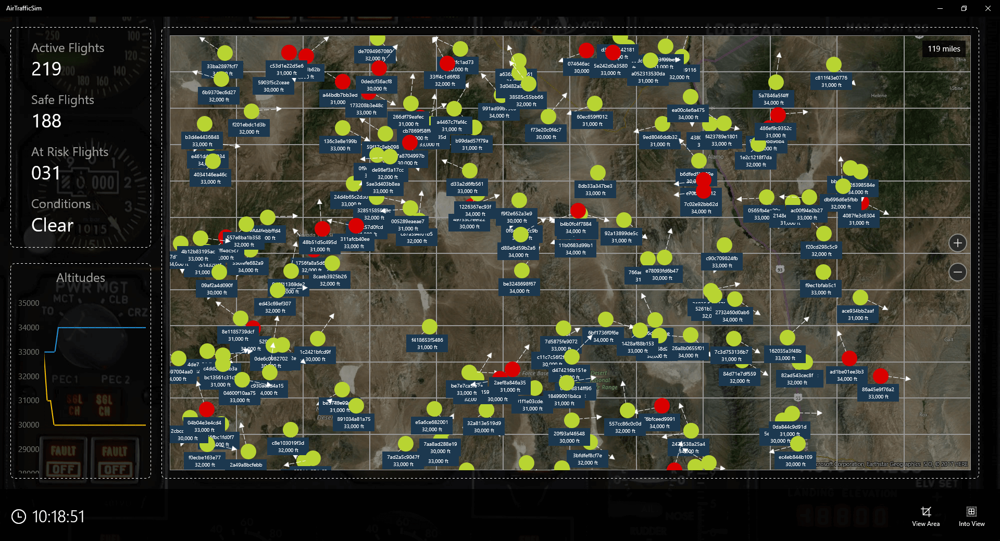

_The Air-Traffic Control application_

You will be the pilot of one of these aircraft. And to do the flying, you will use hardware provided to you for this event. The [MXChip](https://microsoft.github.io/azure-iot-developer-kit/) is an Arduino-based device that is ideal for prototyping IoT solutions. It features an array of sensors, including an accelerometer, a gyrometer, and temperature and humidity sensors, and it includes built-in WiFi so it can transmit data to Azure IoT Hubs wirelessly. It also features a micro-USB port by which you can connect it to your laptop, upload software, and power the hardware. You will control your aircraft by tilting the MXChip backward and forward to go up and down, and rotating it left and right to turn.

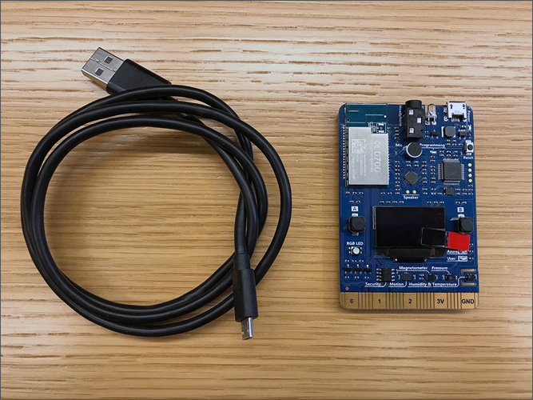

_IoT development board_

The goal of this lab is to get the device up and running and sending events to an Azure IoT Hub. Let's get started!

## Prerequisites ##

The following are required to complete this lab:

- An [MXChip IoT DevKit](https://microsoft.github.io/azure-iot-developer-kit/)
- A computer
- An active Microsoft Azure subscription. If you don't have one, [sign up for a free trial](http://aka.ms/WATK-FreeTrial)
- An available WiFi connection or mobile hotspot. Note that the WiFi connection can (and should) be secure, but it must be ungated (i.e. no intermediate login page is required. Gated WiFi is common in public venues and hotels).

## Exercises ##

This lab includes the following exercises:

- [Exercise 1: Power up the device and connect to WiFi](#Exercise1)
- [Exercise 2: Prepare a development environment](#Exercise2)
- [Exercise 3: Provision an Azure IoT Hub](#Exercise3)
- [Exercise 4: Send Messages to IoT Hub](#Exercise4)
- [Exercise 5: Check IoT Hub activity](#Exercise5)

Estimated time to complete this lab: **60** minutes.

## Exercise 1: Power up the device and connect to WiFi ##

You have already received a package containing an MXChip IoT DevKit and a USB cable. In this exercise, you will connect the device to your laptop, allow Windows to install drivers for it, and connect the device to WiFi so it can transmit events to an Azure IoT Hub.

1. Connect the micro end of the USB cable to the micro-USB port on the device (1). Then connect the other end of the cable to a USB port on your computer (2). Confirm that the green LED next to the micro-USB port on the board lights up (3), and that "No WiFi Enter AP Mode to config" appears on the screen of the device.

	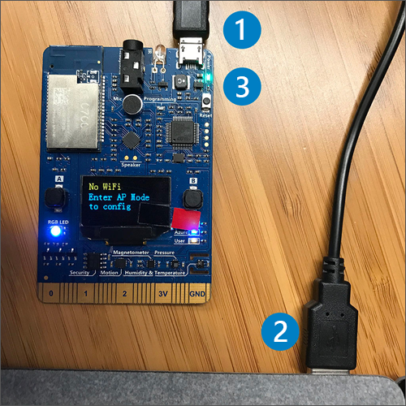

    _Connecting the device to your laptop_

1. Wait for Windows to install the necessary drivers on your laptop. Then open a File Explorer window and confirm that it shows a new drive named "AZ3166." The drive letter that it is assigned to it may be different on your computer.

	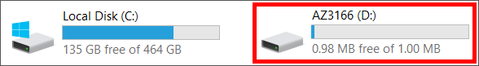

    _The installed device_

1. Now that the device has power and your device recognizes it as a USB device, the next step is to get it connected to WiFi. That involves putting the device into access-point (AP) mode so that it acts as a WiFi access point, connecting to it with a browser, and configuring it to connect to the access point in the room. Put the device into AP mode by doing the following:

	- Press and hold the **B button**
	- With the B button held down, press and release the **Reset button**
	- Release the **B button**

	Verify that an SSID and an IP address appear on the device screen. The IP address is the one that you will use to connect to the device from your laptop.

	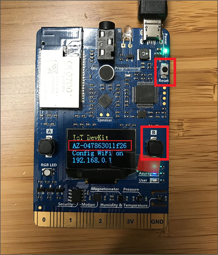

    _Putting the device into AP mode_

1. On your laptop, browse the available networks and connect to the access point whose name is shown on the device screen. If you are prompted for a password, **leave the password empty**. If asked whether to allow your computer to be discoverable by other PCs on the network, answer no.

	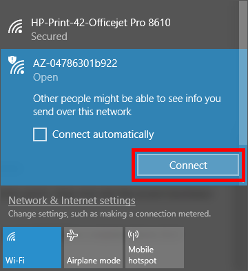

    _Using the device as an access point_

1. Open a browser window and type the IP address shown on the device in Step 3 into the address bar.

1. Select the WiFi network set up for the event and enter the password provided by the event facilitator. Then click **Connect**.

	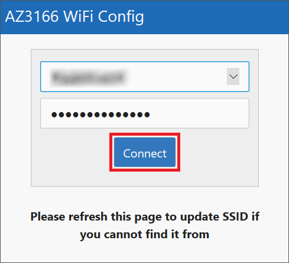

    _Connecting the device to WiFi_

1. Confirm that the device successfully connects to WiFi and make note of the IP address it was assigned. If for any reason you are unable to connect to WiFi this way, try configuring it manually using the [instructions provided here](https://github.com/BretStateham/azure-iot-devkit-manual-wifi).

	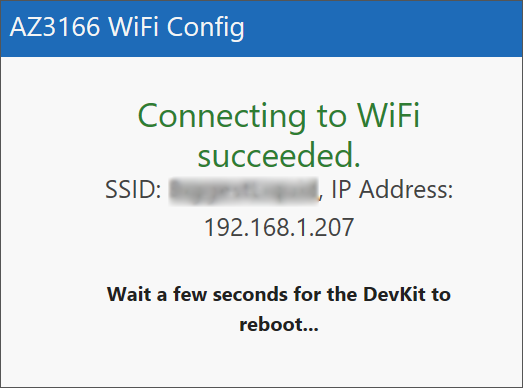

    _Results of a successful connection_

1. Confirm that the screen says "WiFi Connected" and displays the IP address shown in the previous step. If it doesn't — or if the IP address flashes by too quickly for you to read — disconnect the board from your laptop and then plug it back in.

	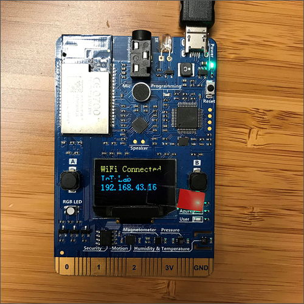

    _Connected!_

1. Go to [Upgrade DevKit Firmware](https://microsoft.github.io/azure-iot-developer-kit/docs/firmware-upgrading/) and follow the instructions there to make sure you are running the latest version of the firmware. The firmware is constantly being improved, and the boards don't always come with the latest version of the firmware installed. You can check the [Versions and Release Notes](https://aka.ms/iot-kit-firmware) to compare the latest firmware version with the one currently installed on your MXChip. Note that your board will only show the first three numbers of the version, and not the final revision (e.g. if the final version is **1.2.0.28**, your board will only show **1.2.0**).

Now that the device is connected to WiFi, it will automatically connect again if it is powered off and back on. If you later decide to connect it to another network, simply repeat Steps 3 through 8 of this exercise.

## Exercise 2: Prepare a development environment ##

In order to write code and upload it to the MXChip, you need to set up a development environment that includes Node.js, Yarn, the Arduino IDE, and any text editor of your choice (ex: Notepad). Fortunately, you can find everything you need to download at the following links:

[Dropbox Download](https://www.dropbox.com/s/mr3ej03h8osum4y/NSBE_download_win.zip?dl=0)

** Also ask around for USBs with downloads on it

1. After all tools have been downloaded, unplug the USB cable from your device. Then install the Arduino app `arduino-1.8.3-windows.exe`. Click Agree to the License Agreement, Click Next for the Installation options, and then Click the Install button. If any Adafruit driver windows open during this process, click the Install buttons on those windows too.

1. Start the Arduino app by clicking on the desktop icon. If you are prompted to allow traffic through the firewall, click **Allow Access**. Select **File** menu > **Preferences**. In the Preferences window, look for the box that says *Additional Boards Manager URLs* copy and paste the following inside then click **OK**:

	`https://raw.githubusercontent.com/VSChina/azureiotdevkit_tools/master/package_azureboard_index.json,http://downloads.arduino.cc/packages/package_index.json`

1. Plug the USB cable back into the device. If you are prompted to allow Java traffic through the firewall, click **Allow Access**.

1. In the Arduino app select the **Tools** menu > **Board**, Then select **Board Manager**.

1. Type "AZ3166" into the search box and verify that the latest version of the IoT Developer Kit is installed. It should be the same version that's displayed on your MXChip screen. The version number is displayed in a drop down next to the Install button. If it is not, click the drop down button and select the latest version from the list. Then click the **Install** button to update the developer kit. The install should take around 4 minutes.

	

	_Adding the AZ3166 Board_

1. Open the command palette again and select **Arduino: Library Manager**. Type "ArduinoJson" into the search box. If the version of the package that's installed isn't the latest version shown in the drop-down list, select the latest version from the list and click **Install** to install it.

	

  _Updating the ArduinoJson library_

In [Exercise 4](#Exercise4), you will use the development environment you just set up to upload code to the MXChip that transmits data to an Azure IoT Hub. Your next task, however, is to create the IoT Hub.

## Exercise 3: Provision an Azure IoT Hub ##

[Azure IoT Hubs](https://docs.microsoft.com/azure/iot-hub/iot-hub-what-is-iot-hub) enable IoT devices to connect securely to the cloud and transmit messages (events) that can be sent to other sources such as mobile apps, websites and etc.

In this exercise, you will provision an Azure IoT Hub for your MXChip to transmit events to.

1. Open the [Azure Portal](https://portal.azure.com) in your browser. If asked to log in, do so using your Microsoft account.

1. Click **+ New**, followed by **Internet of Things** and **IoT Hub**.

	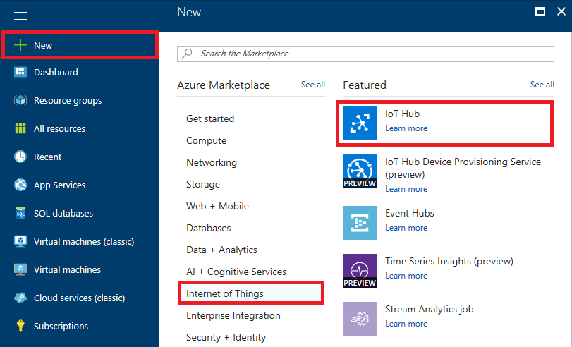

    _Provisioning a new IoT Hub_

1. Enter a unique name for IoT Hub in the **Name** field. IoT Hub names must be unique across Azure, so make sure a green check mark appears next to it. Also make sure **S1 - Standard** is selected as the pricing tier. Select **Create new** under **Resource group** and enter the resource-group name "FlySimResources." Select **East US** as the **Location** (important!). Accept the default values everywhere else, and then click **Create**.

	> You selected East US as the location because in Lab 3, the instructor will create Azure resources in that same region for the IoT Hub to connect to. Azure resources can be connected across regions, but keeping everything within the same data center reduces cost and minimizes latency.

	

    _Configuring an IoT Hub_

1. Click **Resource groups** in the ribbon on the left side of the portal, and then click **FlySimResources** to open the resource group.

	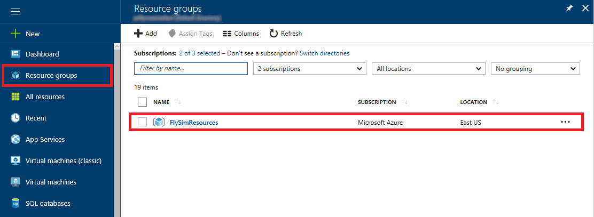

    _Opening the resource group_

1. Wait until "Deploying" changes to "Succeeded," indicating that the IoT Hub has been provisioned. You can click the **Refresh** button at the top of the blade to refresh the deployment status.

	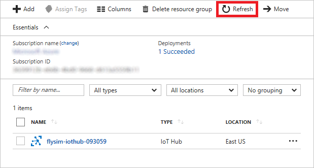

    _Successful deployment_

Select the iothub you created. Next you want to register your device to the IoTHub you created.

1. In the IoT Hub menu, select the **Devices** option

    _Devices Option_

1. You should not have any devices already listed. To register your device, select the **Add** button in the Devices blade.

    _Add Device_

 1. An Add Device pop up window will show. Create a device named *AZ3166* and press **Save**

 

 1. Once the device is added, select the device and the **Device Detail** blade will pop up. Please store the *Primary Key* and *Connection String - Primary*

  

## Exercise 4: Send Message to IoT Hub ##

## Exercise 5: Check IoT Hub activity ##

In this exercise, you will use the Azure portal to confirm that the MXCHip is registered with the IoT Hub you created in [Exercise 3](#Exercise3), and also confirm that the hub is receiving messages from the device.

1.  Return to the Azure portal and to the "FlySimResources" resource group. Then click the IoT Hub that you created in Exercise 3.

	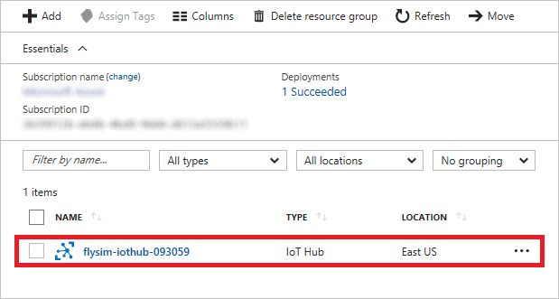

    _Opening a blade for the IoT Hub_

1. Click **Overview** and look at the count of messages received and the number of devices registered. Confirm that the device count is 1, and that the number of messages received is greater than zero.

	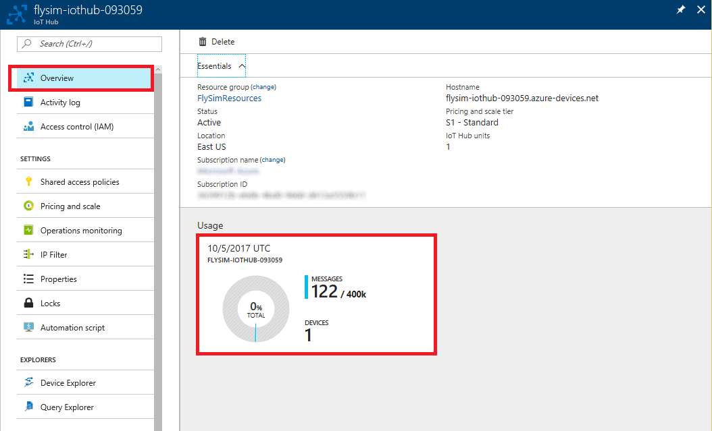

    _Stats regarding the IoT Hub_

1. Click **Device Explorer** to display a list of all devices that are registered to communicate with this IoT Hub. Confirm that your device ("AZ3166") appears in the list.

	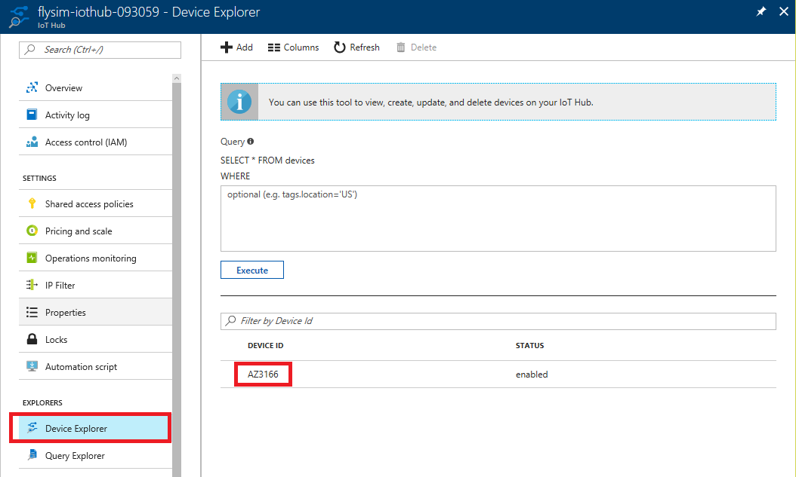

    _Devices registered with the IoT Hub_

[put node code here to see messages from IoT hub]

## Summary ##

In this lab, you created an Azure IoT Hub and configured your MXChip to send data to it.

In Lab 2, you will build the infrastructure necessary to fly a simulated aircraft using the MXChip. That infrastructure will consist of an Azure Function that transforms accelerometer readings passing through the IoT Hub into flight data denoting the position and attitude of an aircraft, as well as an Azure Event Hub that receives data from the Azure Function. Once the Function and Event Hub are in place, you will connect a client app to the Event Hub and practice flying an aircraft by tilting your MXChip backward and forward to go up and down and rotating it right and left to bank and turn. In other words, the fun is just beginning!
